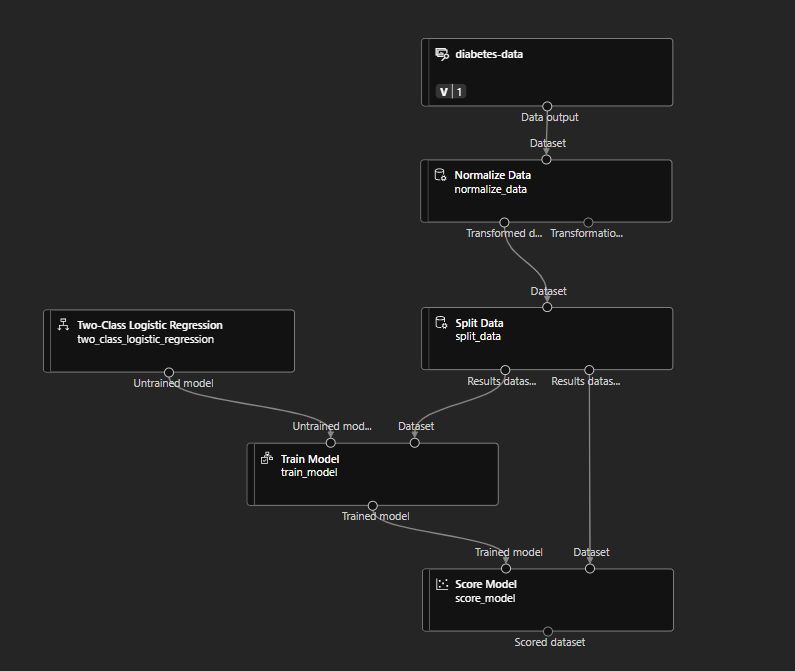
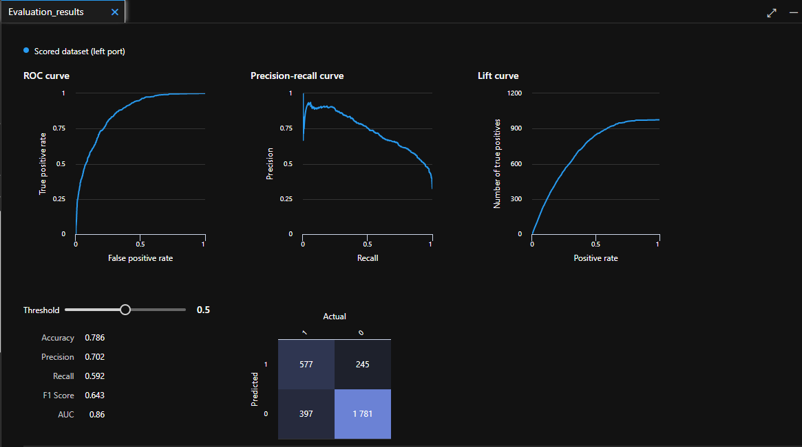
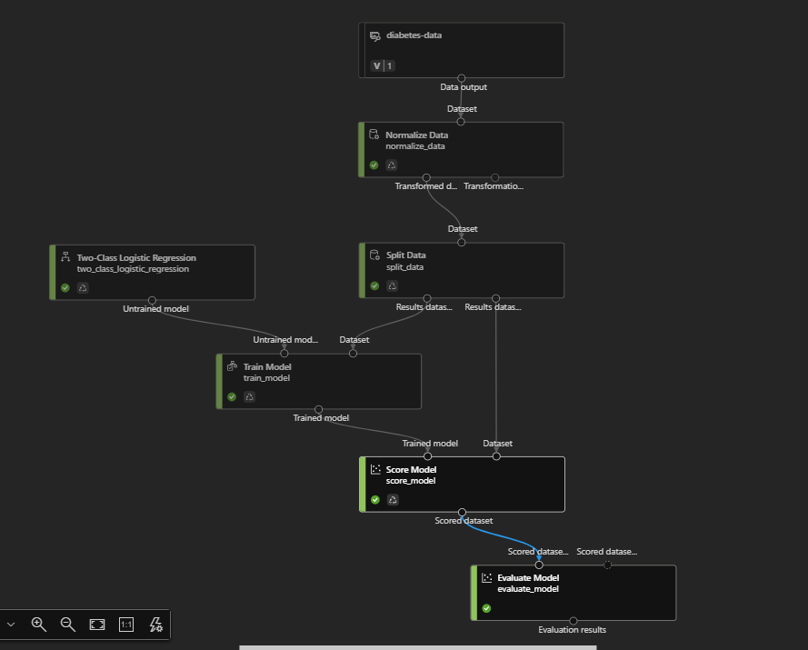
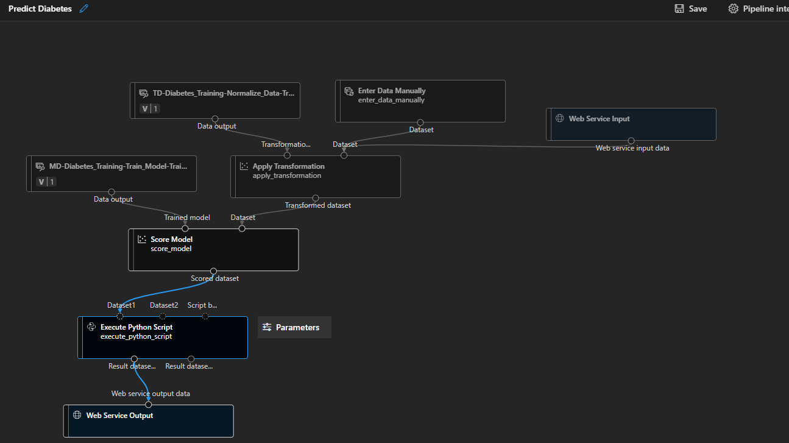
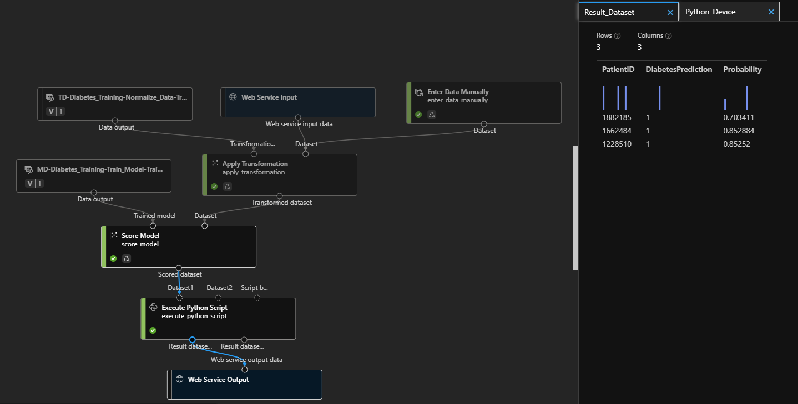
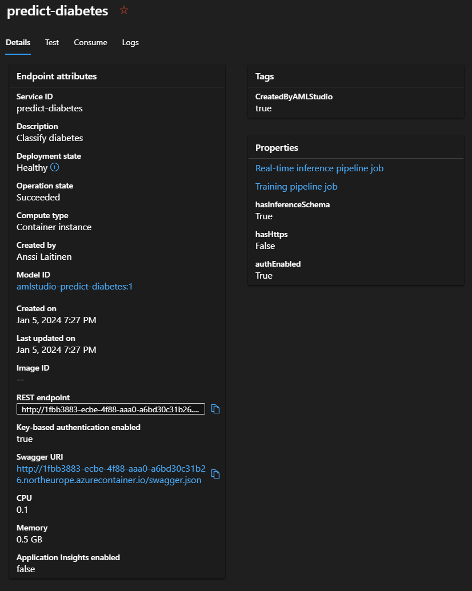

# Diabetes prediction

### Started by making Azure Machine Learning resources and a workspace

### Created compute resources

### Dataset from: https://raw.githubusercontent.com/MicrosoftLearning/mslearn-dp100/main/data/diabetes.csv

### Created database from the file
	Type: tabular
	Delimiter: comma
	Encoding: UTF-8
	File format: Delimited
	Column headers: Only first file has headers
	Number of rows to skip: None
	Dataset contains multi-line data: false

 
 

 ### Creating a pipeline:
    -Add the dataset
    -Data transformation to normalize the data

### First run of the pipeline

#### Split data module:
	Splitting mode: Split rows
	Fraction of rows in the firt output dataset: 0.7
	Random seed: 123
	Stratified split: False
 
#### Train model module:
	Label column: Diabetic

#### Two-class Logistic Regression module: 
	Because Diabetic result is binary 0 / 1)

#### Score-model module:
	for scoring the validation dataset

### Time for second run

### Model is now predicting values

#### Third run with newly added evaluate model module

### Creating an inference pipeline

	-removed the original diabetes dataset
	-added "Enter data manually" module (does not include "Diabetic" column)
	-removed "Evaluate model" module
	-added a "Excecute Python Script" module to return only patient ID, predicted
	label value and probability

	import pandas as pd
	def azureml_main(dataframe1 = None, dataframe2 = None):
   	 scored_results = dataframe1[['PatientID', 'Scored Labels', 'Scored Probabilities']]
    	scored_results.rename(columns={'Scored Labels':'DiabetesPrediction',
                      	          'Scored Probabilities':'Probability'},
                    	    inplace=True)
   	 return scored_results

	(had to do the code up above several times)

#### Time to run the pipeline

### Deploying a predictive service

	Deploying a service with Azure Container Instance

	Waited for a few minutes (40) for the model to get up and running properly

	In the mean time created a new jupyter notebook with test code in it (provided in 	github)

 ### Endpoint in action

 
 

 #### Consume page reveals the endpoint address and API-keys
	Added these to the test code and the endpoint gave a succesful prediction and respose.

 

	
