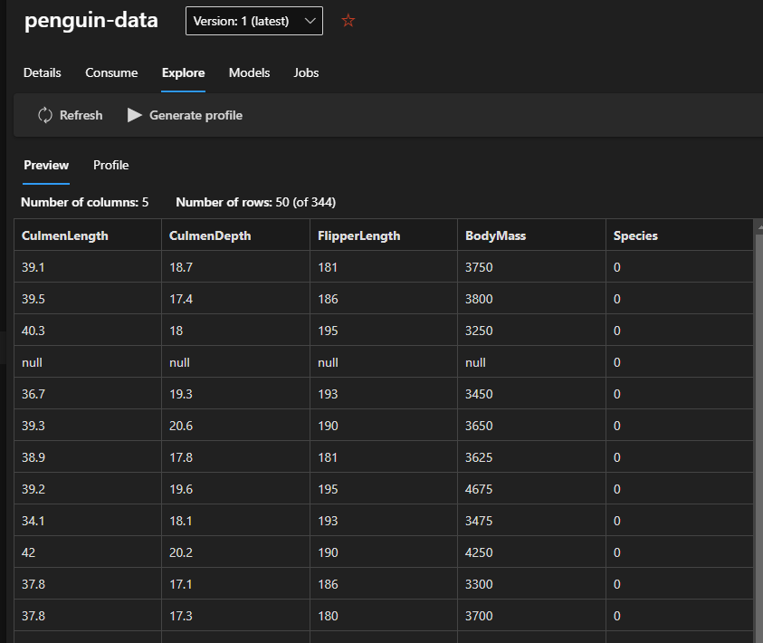
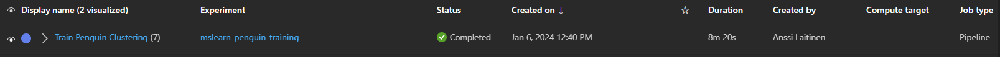
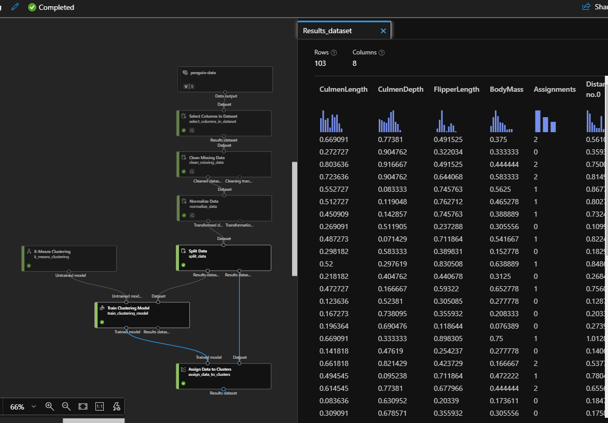
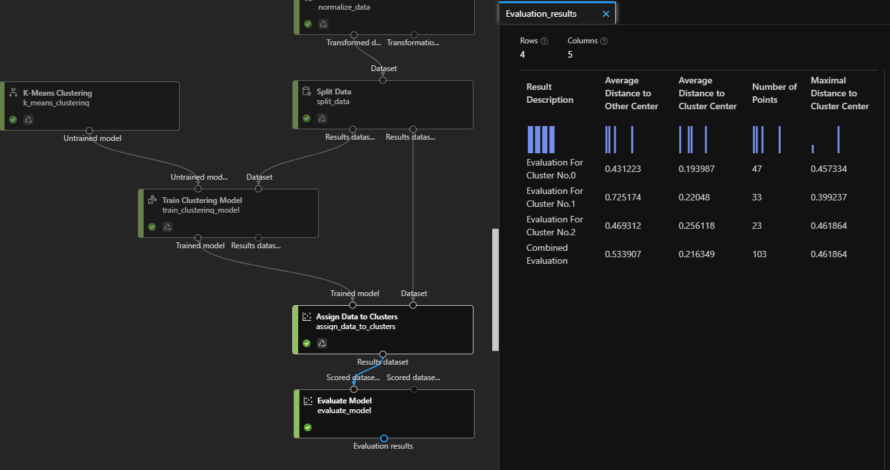
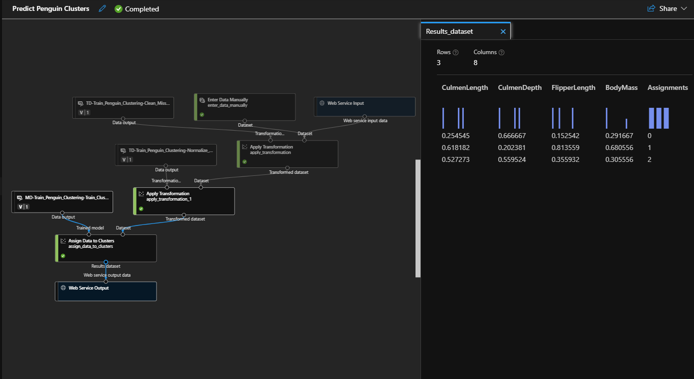

# Clustering Penguins

This project focuses on building a pipeline and endpoint for a model to cluster penguins using Azure Machine Learning Studio.

## Creating a dataset

Basic Info:

- **Web URL:** [https://aka.ms/penguin-data](https://aka.ms/penguin-data)
- **Name:** penguin-data
- **Dataset Type:** Tabular

### Settings and Preview

- **File format:** Delimited
- **Delimiter:** Comma
- **Encoding:** UTF-8
- **Column headers:** Use headers from the first file
- **Skip Rows:** None
- **Schema:** Include all columns other than Path

## Creating a pipeline

- Add dataset
- Select Columns
  - select everything else than "Species" (predicted)
- Clean Missing Data
  - select every column
  - Minimum missing value ratio: 0.0
  - Maximum missing value ratio: 1.0
  - Cleaning mode: Remove entire row
- Normalize Data
  - MinMax
  - All columns

## First run

## Extend the pipeline to train a model

- Split Data
  - Splitting mode: Split Rows
  - Fraction of rows in the first output dataset: 0.7
  - Random seed: 123
  - Stratified split: False

- Train Clustering Model
  - Uses all columns

- K-Means Clustering
  - Number of centroids: 3 (3 species of penguins)

- Assign Data to Clusters

## Second run

## Third run with Evaluate Model

## Creating an Inference Pipeline

## Deploying a Predictive Service

- Deploy a real-time endpoint
- Name: predict-penguin-clusters
- Description: Cluster penguins.
- Compute type: Azure Container Instance.

(wait for 40 minutes for the deployment state to turn "Healthy")

## Testing the endpoint webservice

- Rest endpoint address and API-keys can be found in "Consume" page
- Added credentials to "Test-Penguins.ibynb" (included) and ran a test

